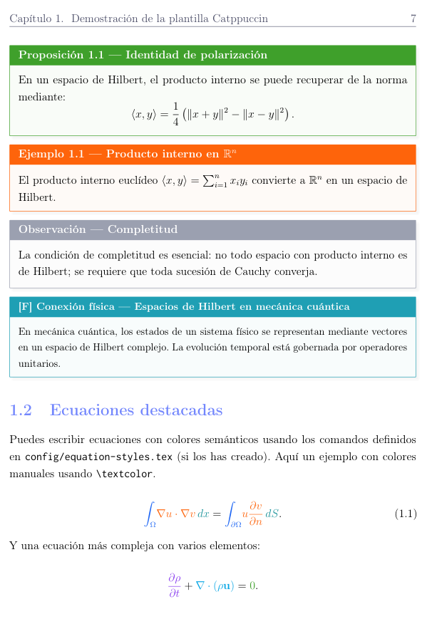

# latex-catppuccin-academic

A modular LaTeX template for academic documents — lecture notes, theses, technical reports — styled with the [Catppuccin](https://catppuccin.com) color palette.

Built for computational physics: mathematics, stochastic processes, machine learning, and numerical methods. Every visual element — theorems, equations, tables, algorithms, code listings, plots — follows the Catppuccin palette coherently and adapts automatically when switching between flavors.



## Features

### Theming

- **Full Catppuccin palette** across all elements: titles, hyperlinks, code listings, algorithms, `tcolorbox` environments, `pgfplots` graphs, table headers, and captions. All follow the [Catppuccin style guide](https://catppuccin.com/style-guide).
- **Four flavors**: Latte (light), Frappé, Macchiato, Mocha (dark). Switch by changing one line in `themes/catppuccin-palette.tex`.
- **Dark theme support**: a `\darktheme` toggle automatically adjusts page color, text color, and tcolorbox backgrounds (`CtpBase`-relative instead of `white`-relative) for correct rendering in dark flavors.
- **Custom theme fallback**: `themes/custom-theme.tex` for non-Catppuccin color schemes using the same semantic color names.

### Semantic equation coloring

A three-axis system for color-coding equations by meaning, not appearance (`config/equation-styles.tex`):

- **Axis 1 — Syntactic role** (stable across contexts): `\eqop` (operators), `\eqfn` (functions), `\eqdm` (differentials), `\eqdom` (domains).
- **Axis 2 — Epistemic status** (the dimension typography *cannot* encode): `\equ` (unknown/sought), `\eqk` (known/data), `\eqcon` (universal constants). In `f(x;θ)`, physics treats `x` as unknown and `θ` as data; ML inverts this. The color makes the inversion explicit.
- **Axis 3 — Mathematical type** (subtle reinforcement): `\eqvec` (vectors), `\eqten` (tensors/matrices).
- **Compound macros**: `\eqpdv`, `\eqgrad`, `\eqdvg`, `\eqSDE` for common patterns.
- **Global toggle**: `\eqcolorsfalse` disables all equation coloring for B/W printing.

### Tables

Comprehensive table system (`config/tables-config.tex`) with three overflow strategies:

- **Prevention**: `tabularx` with custom column types `Y` (centered) and `Z` (right-aligned), all vertically centered via `m{}` columns.
- **Correction**: `fittable` environment that measures width and rescales only if needed.
- **Precision**: fixed-width columns `L{w}`, `C{w}`, `R{w}` with automatic text wrapping.
- **Styling**: `\headerrow` for colored headers, `\rowcolor{tablerowalt}` for alternating rows, `\thead` for bold header text, `\tablenote` for footnotes. Automatic `\arrayrulecolor` from the theme.
- **Numerical alignment**: `siunitx` S-columns for decimal-aligned data with SI units.
- **Spanish**: `Cuadro` renamed to `Tabla` automatically.

### Code listings (10 languages)

Syntax highlighting for ten languages (`config/listings-catppuccin.tex`), each with full keyword classification mapped to Catppuccin colors:

| Language    | Style name    | Keywords | Builtins | Types | Functions | Modules | Macros |
|-------------|---------------|:--------:|:--------:|:-----:|:---------:|:-------:|:------:|
| Python      | `python`      | ✓        | ✓        | ✓     | ✓         | ✓       | ✓      |
| C           | `c`           | ✓        | ✓        | ✓     | ✓         | —       | ✓      |
| C++         | `cpp`         | ✓        | ✓        | ✓     | ✓         | ✓       | —      |
| Rust        | `rust`        | ✓        | ✓        | ✓     | ✓         | ✓       | ✓      |
| Go          | `go`          | ✓        | ✓        | ✓     | ✓         | ✓       | —      |
| Julia       | `julia`       | ✓        | ✓        | ✓     | ✓         | ✓       | ✓      |
| MATLAB      | `matlab`      | ✓        | ✓        | ✓     | ✓         | ✓       | —      |
| Fortran     | `fortran`     | ✓        | ✓        | ✓     | ✓         | ✓       | ✓      |
| x86-64 ASM  | `asm`         | ✓        | ✓        | ✓     | ✓         | —       | ✓      |
| Mathematica | `mathematica` | ✓        | ✓        | ✓     | ✓         | ✓       | —      |

Color mapping follows the Catppuccin style guide: keywords → Mauve, builtins → Red, strings → Green, comments → Overlay2 (italic), types → Yellow, functions → Blue, modules → Teal, macros → Rosewater.

Full UTF-8 support via `literate` mappings (Spanish accents, Greek letters, mathematical symbols).

### Plots

`pgfplots` configuration (`config/pgfplots-config.tex`) with:

- **Cycle list**: 8 distinguishable Catppuccin colors with unique markers per curve.
- **Axis styles**: `catppuccin-clean` (publication-ready) and `catppuccin-filled` (with `CtpMantle` background for presentations).
- **Colormaps**: `catppuccin-heat` (sequential: Base → Blue → Mauve → Red → Yellow) and `catppuccin-diverge` (divergent: Blue → neutral → Red) for surfaces and heatmaps.
- **Themed elements**: legend, grid, ticks, error bars, and colorbar all use palette colors.

### Captions

Styled captions (`config/captions-config.tex`):

- Figures: label in `CtpBlue`
- Tables: label in `CtpMauve`
- Code listings: label in `CtpGreen`, renamed to "Código" in Spanish
- Subfigures: label in `CtpSapphire`
- Text in `CtpSubtext0`, hang format with endash separator.

### Mathematics and physics

- **`physics` package** integrated: `\abs`, `\norm`, `\grad`, `\div`, `\curl`, `\laplacian`, `\dv`, `\pdv`, `\bra`, `\ket`, `\braket`, `\comm`, etc.
- **`siunitx`** for consistent SI units and numerical formatting (Spanish locale).
- **Custom macros** (`config/macros.tex`): number sets (`\R`, `\N`, `\Z`, `\C`, `\Q`), optimization (`\argmin`, `\argmax`), ML/statistics (`\Loss`, `\E`, `\KL`, `\Var`, `\Cov`), physics aliases (`\Lap`, `\Div`, `\keff`, `\score`, `\FP`, `\SDE`).

### Document structure

- **Modular architecture**: configuration split across `config/`, `environments/`, `themes/`, `frontmatter/`, `chapters/`, `backmatter/`.
- **Metadata-driven**: `metadata.tex` controls title, subtitle, author, date, dedication, epigraph, acknowledgements, and PDF metadata — no need to edit `main.tex`.
- **Smart references**: `cleveref` with Spanish names (`\cref{eq:foo}` → "ec. 1.1", `\Cref{fig:bar}` → "Figura 2.3").
- **Appendix support**: `appendix` package with `\begin{appendices}...\end{appendices}`.
- **PDF features**: `hyperref` with themed link colors + `bookmark` for clean PDF outlines. PDF metadata populated from `metadata.tex`.
- **Spanish language**: `babel` with `es-noshorthands`, `csquotes`, proper `\tablename`, `\lstlistingname`.

### Environment system

Generator-based architecture (`environments/generator.tex`) for theorem-like environments:

| Environment        | Color      | Counter | Purpose                      |
|--------------------|------------|:-------:|------------------------------|
| `definicion`       | Blue       | ✓       | Definitions                  |
| `teorema`          | Mauve      | ✓       | Theorems                     |
| `proposicion`      | Green      | ✓       | Propositions                 |
| `ejemplo`          | Peach      | ✓       | Examples                     |
| `observacion`      | Overlay0   | —       | Remarks                      |
| `fisicaconexion`   | Sapphire   | —       | Physics connections          |
| `estrella`         | Yellow     | ✓       | "Polar Star" problems        |
| `ejerciciocomp`    | Pink       | ✓       | Computational exercises      |
| `ejercicio`        | —          | ✓       | Theoretical exercises (plain)|
| `notasbib`         | Gray       | —       | Bibliographic notes          |

### Additional features

- **Algorithm styling**: `algorithm2e` with colored keywords, comments, line numbers, and vertical connector lines matching the palette.
- **Float control**: `placeins` (`\FloatBarrier`), `wrapfig`, `subcaption`.
- **TikZ libraries**: `calc`, `decorations.pathreplacing`, `patterns`, `matrix`, `tikz-cd` (commutative diagrams).
- **PDF inclusion**: `pdfpages` for inserting external PDFs.
- **`cancel`** for crossing out terms in derivations.
- **Difficulty indicator**: `\dificultad{math}{physics}` renders a star-rated box.

## Project structure

```
.
├── main.tex                     # Root document (load order matters)
├── metadata.tex                 # Document metadata
├── references.bib               # BibTeX bibliography
├── config/
│   ├── packages.tex             # All package loading (30+ packages)
│   ├── geometry.tex             # Page layout, headers/footers
│   ├── hyperref.tex             # Hyperlink config (loads after theme)
│   ├── macros.tex               # Math/physics macros (complements physics pkg)
│   ├── tcolorbox-config.tex     # Base tcolorbox style
│   ├── titles-config.tex        # Chapter/section formatting
│   ├── listings-catppuccin.tex  # Code listings (10 languages)
│   ├── algorithms.tex           # Algorithm2e styling
│   ├── tables-config.tex        # Table overflow, columns, colors
│   ├── equation-styles.tex      # Semantic equation coloring (3-axis)
│   ├── pgfplots-config.tex      # Plot styles, cycle list, colormaps
│   └── captions-config.tex      # Caption formatting
├── environments/
│   ├── generator.tex            # Environment factory
│   ├── instances.tex            # Concrete environments
│   └── specials.tex             # Exercises, difficulty, bib notes
├── themes/
│   ├── catppuccin-palette.tex   # Main theme (Latte/Frappé/Macchiato/Mocha)
│   ├── catppuccin-latte.tex     # Alternate config
│   └── custom-theme.tex         # Non-Catppuccin fallback
├── frontmatter/
│   ├── titlepage.tex            # Title page layout
│   ├── preliminary.tex          # Dedication, epigraph, acknowledgements
│   └── preface.tex              # Preface
├── chapters/
│   └── chapter1.tex             # Template demo (all features)
├── backmatter/
│   └── appendixA.tex            # Code listings gallery (10 languages)
├── figs/                        # Figures directory
└── code/                        # Code snippets directory
```

## Load order

The order in `main.tex` matters. The current sequence:

```
packages → geometry → metadata → THEME → hyperref → macros →
tcolorbox → environments → titles → listings → algorithms →
tables → equations → pgfplots → captions → DOCUMENT
```

The theme must load before `hyperref` (link colors), `listings` (syntax colors), `tables` (header colors), `equations` (semantic colors), `pgfplots` (cycle list), and `captions` (label colors).

## Quick start

1. **Clone**
   ```bash
   git clone git@github.com:Zessinthel/latex-catppuccin-academic.git
   cd latex-catppuccin-academic
   ```

2. **Edit `metadata.tex`** with your document info.

3. **Choose a flavor** in `themes/catppuccin-palette.tex`:
   ```latex
   \usepackage[Latte,styleAll]{catppuccinpalette}    % light
   %\usepackage[Mocha,styleAll]{catppuccinpalette}   % dark
   ```
   For dark flavors, also uncomment `\darkthemetrue`.

4. **Compile**
   ```bash
   latexmk -pdf main.tex
   ```
   Or manually:
   ```bash
   pdflatex main.tex && bibtex main && pdflatex main.tex && pdflatex main.tex
   ```

## Requirements

A full TeX Live or MiKTeX installation with these packages (all standard):

**Core**: `tcolorbox`, `algorithm2e`, `listings`, `tikz`, `pgfplots`, `natbib`, `titlesec`, `fancyhdr`, `hyperref`, `microtype`, `booktabs`, `inconsolata`, `catppuccinpalette`.

**Mathematics**: `amsmath`, `amssymb`, `amsthm`, `mathtools`, `bm`, `physics`, `cancel`, `siunitx`.

**Tables**: `tabularx`, `longtable`, `multirow`, `colortbl`, `array`.

**Figures**: `graphicx`, `caption`, `subcaption`, `float`, `wrapfig`, `placeins`.

**Structure**: `appendix`, `pdfpages`, `cleveref`, `bookmark`, `csquotes`, `footmisc`.

**Diagrams**: `tikz-cd`, `pgffor`.

**Programming**: `etoolbox`, `xparse`, `enumitem`, `pifont`.

## Customization

**Switching flavors**: change the `\usepackage[Latte,...]{catppuccinpalette}` option. For dark flavors, uncomment `\darkthemetrue`.

**Equation coloring**: edit the color assignments in `config/equation-styles.tex` (e.g., `\colorlet{equ}{CtpPeach}` → any other `Ctp*` color). Disable globally with `\eqcolorsfalse`.

**Adding languages**: define a new style in `config/listings-catppuccin.tex` following the existing pattern. The 8 keyword classes map to fixed colors.

**Adding chapters**: create `chapters/chapterN.tex` and add `\include{chapters/chapterN}` in `main.tex`.

**Table colors**: edit `\colorlet{tableheadcolor}{...}` and related in `config/tables-config.tex`.

**Plot colors**: edit the cycle list in `config/pgfplots-config.tex` or create custom colormaps.

**Extending macros**: add commands to `config/macros.tex`. The `physics` package covers most standard notation; only add what it doesn't provide.

## License

This template is released under the [MIT License](LICENSE). The Catppuccin color palette is © Catppuccin contributors, used under their license terms.

## Author

**Antonio Casanova** — [GitHub](https://github.com/Zessinthel) · [GitLab](https://gitlab.com/Zessinthel)
